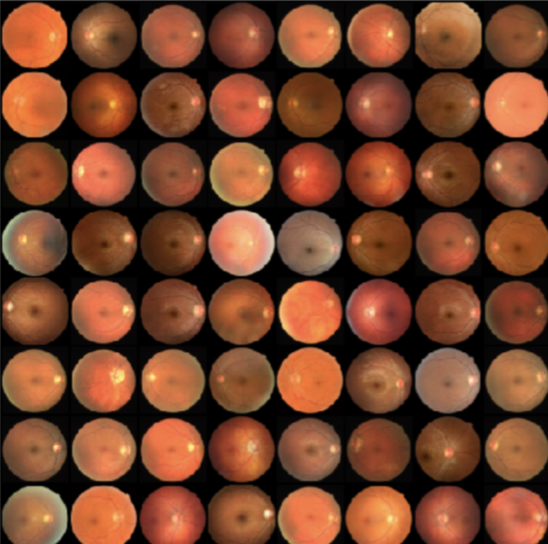
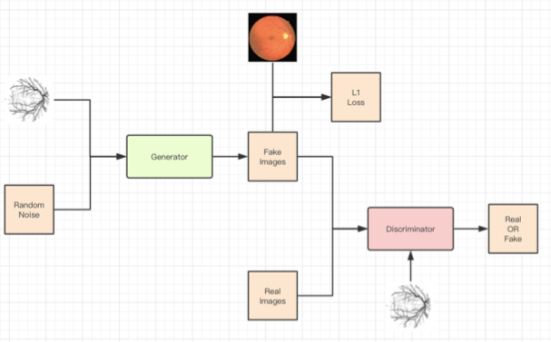

# Retinal-Image-GAN

Code for **"GAN-Based Intelligent Generation of Retinal Images"** in Participate in Research Program at Shanghai Jiao Tong University.

I am exploring two ways to generate normal retinal images:

* DCGAN-based network to generate more normal retinal images and compare them with retinal image with lesion.

Sample Result:

* cGAN-based network to pix-to-pix generate normal retinal images correspond to lesion image.

